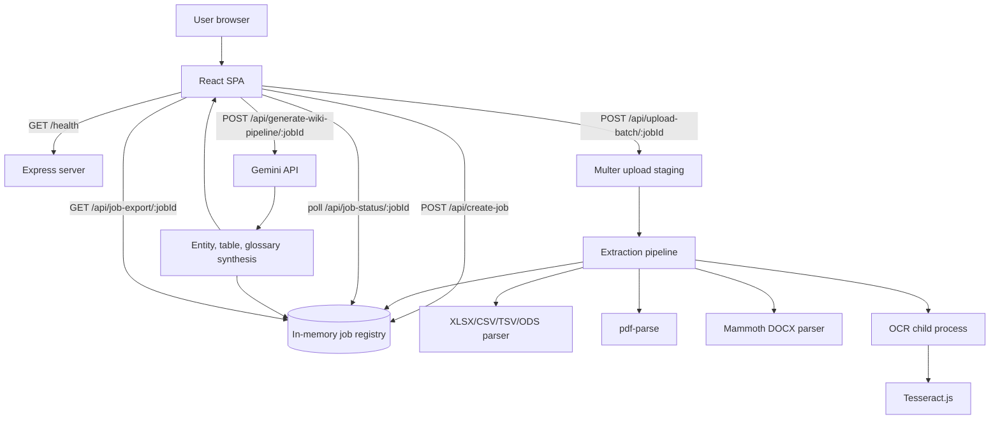

# Hold my Thought

Hold my Thought is a full-stack document-to-wiki application that turns mixed file collections into an explorable knowledge portal. Users upload files or folders, the server extracts text and tables, Gemini builds a dense entity and terminology graph, and the React UI renders the result as a Wikipedia-inspired workspace with downloadable HTML and JSON exports.

## Table of contents

- [What the app does](#what-the-app-does)
- [Architecture at a glance](#architecture-at-a-glance)
- [System design](#system-design)
- [Data model](#data-model)
- [Request and processing flow](#request-and-processing-flow)
- [AI pipeline design](#ai-pipeline-design)
- [File parsing and OCR](#file-parsing-and-ocr)
- [Frontend design](#frontend-design)
- [Backend API](#backend-api)
- [Configuration](#configuration)
- [Run locally](#run-locally)
- [Build and production run](#build-and-production-run)
- [Operational considerations](#operational-considerations)
- [Troubleshooting](#troubleshooting)
- [Project structure](#project-structure)

## What the app does

Hold my Thought helps users convert an unstructured folder of documents into a navigable knowledge base:

1. Upload individual files or an entire folder from the browser.
2. Create a server-side processing job and upload files in batches.
3. Extract readable text and structured tables from spreadsheets, PDFs, text files, DOCX files, and images.
4. Run a Gemini-assisted research compiler pipeline that discovers entities, glossary terms, relationships, and wiki-style explanations.
5. Render extracted entities, source tables, glossary chains, provenance, progress, and quality warnings in the client.
6. Export the current wiki article as standalone HTML and optionally download raw job JSON from the backend.

## Architecture at a glance



The application intentionally uses one Node.js process for API traffic and Vite middleware during development. OCR is isolated in a forked worker so image recognition can time out or fail without blocking the main Express request lifecycle.

## System design

### Runtime layers

| Layer | Main files | Responsibility |
| --- | --- | --- |
| Browser SPA | `src/App.tsx`, `src/index.css` | Upload UX, progress tracking, wiki rendering, glossary traversal, export generation |
| HTTP/API server | `server.ts` | Express API, job orchestration, uploads, parsing, Gemini pipeline, static serving |
| OCR worker | `ocr-worker.ts` | Tesseract image OCR in a child process |
| Build tooling | `vite.config.ts`, `package.json` | React/Vite build, Tailwind plugin, server and worker bundling |

### Key architectural decisions

- **Job-based ingestion:** Upload sessions are represented as jobs with status, progress, results, errors, and creation timestamps. This allows the browser to upload files, poll processing progress, and later ask the server to generate the wiki from completed extraction results.
- **Batch upload strategy:** The client sends files in batches to reduce request size and avoid long-running multipart requests. The server acknowledges each batch as queued while background parsing continues.
- **In-memory state:** Jobs live in an in-memory `Map`. This keeps local development simple, but it means job state is ephemeral and unsuitable for multi-instance production without a shared store.
- **Bounded concurrency:** File parsing is limited with `p-limit` so concurrent CPU- and memory-heavy extraction work does not overwhelm the server.
- **Worker isolation for OCR:** Image OCR runs in a forked process with a hard timeout. A slow OCR operation can be killed independently from the API server.
- **Progressive resilience:** The AI pipeline attempts Gemini extraction first, supplements results with local phrase/acronym mining, and falls back to fully local synthetic wiki data if the Gemini request fails or quota is exhausted.
- **Client-side HTML export:** The browser assembles a standalone HTML wiki from selected entity data and tables, avoiding extra backend rendering infrastructure.

## Data model

### `TableData`

Represents spreadsheet, text-derived, DOCX, or synthesized table content.

| Field | Meaning |
| --- | --- |
| `tableId` | Stable table identifier within a processing job |
| `sheetName` | Optional sheet or matrix name |
| `rowCount` / `colCount` | Parsed table dimensions |
| `data` | Two-dimensional row/cell matrix for spreadsheet-like tables |
| `html` | Raw DOCX table HTML when available |
| `provenance` | Human-readable source statement for auditability |

### `ParsedFile`

Represents the extracted view of one uploaded file.

| Field | Meaning |
| --- | --- |
| `fileId` | Generated identifier |
| `fileName` | Original upload filename or relative folder path |
| `fileType` | File extension |
| `sizeBytes` | Uploaded size |
| `tables` | Extracted or analyzed tables |
| `text` | Extracted text body |
| `ocrConfidence` | Optional OCR confidence for images |
| `needsReview` | Flag set for low-confidence OCR |

### `Job`

Server-side processing envelope.

| Field | Meaning |
| --- | --- |
| `id` | Random job identifier returned to the client |
| `status` | `processing`, `completed`, or `failed` |
| `progress` | Percent completion based on parsed files |
| `totalFiles` / `completedFiles` | Upload session counters |
| `results` | Parsed files plus synthesized matrix file when generated |
| `errors` | Per-file processing errors |
| `createdAt` | Timestamp used for job cleanup and exports |

### Wiki entities and terms

The client consumes AI pipeline output as:

- `folderIntent`: topic, collection type, confidence, and entity type.
- `entities`: wiki article cards with entity name, source files, related table IDs, and article markdown-like sections.
- `wikiTerms`: glossary concepts with definitions, categories, related terms, and provenance files.

## Request and processing flow

### 1. Health check

On mount, the SPA polls `GET /health` until the backend is ready. The root health route is intentionally outside `/api` so it also works as a simple platform liveness endpoint.

### 2. Job creation

The client calls `POST /api/create-job` with `totalFiles`. The backend validates the count, allocates a job object, stores it in memory, and returns `jobId`.

### 3. Batch upload

The client sends files to `POST /api/upload-batch/:jobId` as multipart form data. Folder uploads preserve `webkitRelativePath` when available so exported provenance can reflect folder context. The server stages files in `uploads/`, queues parsing work, and immediately returns `{ "status": "queued" }`.

### 4. Background extraction

The backend processes files under a global concurrency limit. Each file is routed by extension:

| File type | Extraction path |
| --- | --- |
| `.xlsx`, `.xls`, `.csv`, `.tsv`, `.ods` | `xlsx` workbook parsing into row matrices |
| `.pdf` | `pdf-parse` text extraction plus table-like line analysis |
| `.txt` | UTF-8 text extraction plus table-like line analysis |
| `.docx` | `mammoth` raw text extraction and table HTML capture |
| `.png`, `.jpg`, `.jpeg` | Tesseract OCR through the forked worker |

After each file, the server deletes the staged upload, updates counters, records errors without crashing the job, and marks the job completed when every file has settled.

### 5. Client polling

The SPA polls `GET /api/job-status/:jobId` until status becomes `completed`. It then stores parsed files and displays any non-fatal extraction errors.

### 6. Wiki generation

The client calls `POST /api/generate-wiki-pipeline/:jobId`. The server compiles extracted file text into retrieval context, chunks it, calls Gemini for entity and glossary extraction, merges local mining results, synthesizes wiki explanations and data matrices, attaches matching table IDs, and returns render-ready JSON.

### 7. Export

The user can export the selected entity page as standalone HTML from the browser. If a `jobId` is available, the UI also offers `GET /api/job-export/:jobId` for raw processed JSON.

## AI pipeline design

The wiki pipeline is designed as a hybrid AI-plus-local system:

1. **RAG-style context compilation:** Parsed text is joined with file names and source delimiters.
2. **Chunking:** Large collections are split into overlapping chunks to keep model calls bounded.
3. **Structured extraction:** Gemini is prompted to return JSON entities and glossary terms that match a response schema.
4. **Model fallback list:** The server tries multiple Gemini Flash model names for chunk extraction before returning an empty chunk result.
5. **Local mining:** Proper-noun and acronym extraction adds coverage when model output is sparse.
6. **Deduplication:** Entities and terms are merged case-insensitively.
7. **Folder intent classification:** Gemini attempts a collection-level topic/type classification, with local heuristics as backup.
8. **Article synthesis:** The server creates interconnected article sections, glossary links, synthesized metrics tables, and provenance references.
9. **Quota fallback:** A local fallback builder returns useful wiki content if Gemini calls fail at the pipeline level.

## File parsing and OCR

The extraction subsystem prioritizes useful structured data over perfect document fidelity:

- Spreadsheet sheets are converted into matrix tables when they contain at least two rows and two columns.
- Text and PDF files are scanned for simple table patterns using tab, repeated-space, and pipe delimiters.
- DOCX table markup is preserved as HTML and sanitized before browser rendering.
- OCR confidence below 75 marks the file as needing review.
- Unsupported file types fail per file and are added to the job error list instead of aborting the whole upload session.

## Frontend design

The React app is a single component-driven workspace with several coordinated states:

- **Upload state:** drag-and-drop, file/folder input refs, server readiness, active job ID, progress, and errors.
- **Pipeline state:** current step, parsed files, folder intent, entities, selected entity, glossary terms, and selected term.
- **Exploration state:** document/terminology/history tabs, table of contents visibility, and terminology traversal path.
- **Rendering helpers:** table renderer with DOMPurify for DOCX HTML, linkifying of entity and term mentions, quality report toggles, and export construction.
- **Visual style:** Tailwind CSS v4 theme tokens, custom scrollbars, serif wiki typography, and a decorative animated forest/rabbit component.

## Backend API

| Method | Path | Purpose |
| --- | --- | --- |
| `GET` | `/health` | Root liveness check used by the client boot sequence |
| `GET` | `/api/health` | API health and active processing job count |
| `POST` | `/api/create-job` | Create a processing job; body: `{ "totalFiles": number }` |
| `POST` | `/api/upload-batch/:jobId` | Upload one multipart batch under field name `files` |
| `GET` | `/api/job-status/:jobId` | Return job status, progress, parsed results, and errors |
| `POST` | `/api/generate-wiki-pipeline/:jobId` | Generate folder intent, entity pages, glossary terms, and synthesized tables |
| `GET` | `/api/job-export/:jobId` | Download raw processed job data as JSON |

Unknown `/api/*` routes return JSON 404 responses. Non-API routes are handled by Vite middleware in development and by static `dist` assets in production.

## Configuration

Create `.env.local` or another dotenv-compatible environment file with:

```bash
GEMINI_API_KEY="your-gemini-api-key"
APP_URL="http://localhost:3000"
```

`GEMINI_API_KEY` is required for Gemini-backed wiki generation. If it is missing, `/api/generate-wiki-pipeline/:jobId` returns a server error before starting model calls. If Gemini later fails because of quota or model availability, the local fallback path can still produce a usable wiki response.

## Run locally

**Prerequisites:** Node.js 22 or a compatible modern Node.js runtime.

```bash
npm install
cp .env.example .env.local
# Edit .env.local and set GEMINI_API_KEY
npm run dev
```

Open `http://localhost:3000`. The development server runs Express and Vite middleware from one process.

## Build and production run

```bash
npm run build
npm start
```

The build command:

1. Builds the React app with Vite into `dist/`.
2. Bundles `server.ts` to `dist/server.js` for Node.js.
3. Bundles `ocr-worker.ts` to `dist/ocr-worker.js`.

In production, Express serves static assets from `dist/` and falls back to `dist/index.html` for SPA routes.

## Operational considerations

- **Persistence:** Jobs are memory-only and expire after one hour. Use Redis, a database, or object storage for multi-instance or long-lived production deployments.
- **Upload storage:** Uploaded files are temporarily written to `uploads/` and deleted after processing. Ensure the runtime has write access and adequate ephemeral disk.
- **Concurrency:** The global parser concurrency is currently two files at a time. Increase carefully for larger servers; OCR and PDF parsing can be CPU- and memory-intensive.
- **File size:** Multer limits individual files to 100 MB.
- **Security:** DOCX table HTML is sanitized before rendering in React. Continue validating uploaded file types and consider malware scanning for untrusted deployments.
- **Secrets:** Keep `GEMINI_API_KEY` server-side. The current Vite config also defines it for browser build-time compatibility, so production deployments should review whether client exposure is acceptable for their threat model.
- **Scalability:** Because the app uses local filesystem uploads and an in-memory job map, sticky sessions or a shared backend are required before horizontal scaling.
- **Observability:** The server logs incoming requests, API actions, chunk extraction attempts, fallback paths, and system errors to stdout.

## Troubleshooting

| Symptom | Likely cause | Fix |
| --- | --- | --- |
| Client says backend is not responding | Express server is not running or `/health` is unreachable | Run `npm run dev` and verify `http://localhost:3000/health` |
| Wiki generation fails immediately | Missing `GEMINI_API_KEY` | Set the key in `.env.local` or deployment secrets |
| Some files show errors but job completes | Per-file parser failure or unsupported file type | Check the quality/errors panel and convert unsupported formats |
| Image text is missing or low quality | OCR confidence is low or image is blurry | Upload a higher-resolution image or a text-based PDF |
| Job data disappears | In-memory job expired or server restarted | Re-upload files; add persistent storage for production |
| HTML export lacks raw JSON | User declined JSON export or job expired | Use export shortly after processing completes |

## Project structure

```text
.
├── src/
│   ├── App.tsx          # Main React upload, wiki, glossary, and export UI
│   ├── index.css        # Tailwind theme, table styles, animations, scrollbars
│   └── main.tsx         # React application entry point
├── server.ts            # Express API, file parsing, Gemini pipeline, Vite/static serving
├── ocr-worker.ts        # Forked Tesseract OCR worker
├── vite.config.ts       # Vite, React, Tailwind, env, and dev-server config
├── package.json         # Scripts and dependencies
├── .env.example         # Environment variable template
└── README.md            # Project documentation
```

## Development scripts

| Command | Purpose |
| --- | --- |
| `npm run dev` | Start Express with Vite middleware via `tsx server.ts` |
| `npm run build` | Build the SPA and bundle server/worker code |
| `npm start` | Run the production server bundle |
| `npm run lint` | Type-check the TypeScript project with `tsc --noEmit` |
| `npm run clean` | Remove `dist/` |

## License

This repository does not currently declare a license. Add one before distributing or accepting external contributions.
